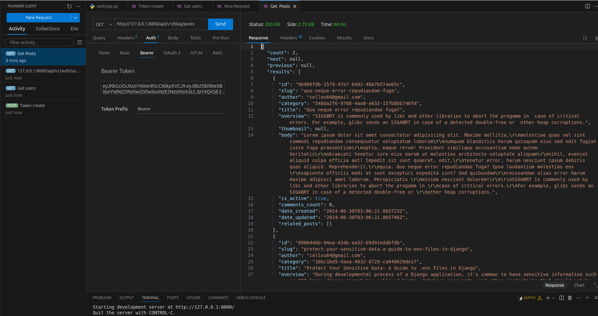

# Here'se an Awesome Blog API

## Summary

This is a simple blog api that allows users to create , read, update and delete posts. It uses `Django` & `DjangoRestFramework` as the server framework with Postgres for database management.

## Screenshots



## How to use ?

### Clone the repo

```bash
git clone https://github.com/Cellou404/AwesomeBlogAPI.git
```

### Create a virtual environment

```bash
python3 -m venv venv
```

### Activate the virtual environment

```bash
source venv/bin/activate
```

### Install the dependencies

```bash
pip install -r requirements.txt
```

### Create a superuser

```bash
python manage.py createsuperuser
```

### Run the server

```bash
python manage.py runserver
```

### Access the server

#### For example: Posts

```bash
http://127.0.0.1:8000/api/v1/blog/posts/
```

## Endpoints

### For example: Posts Endpoints

| Method | Endpoint | Description |
| --- | --- | --- |
| GET | /api/v1/blog/posts/ | Get all posts |
| GET | /api/v1/blog/posts/{id}/ | Get a post by id |
| POST | /api/v1/blog/posts/ | Create a post |
| PUT | /api/v1/blog/posts/{id}/ | Update a post by id |
| DELETE | /api/v1/blog/posts/{id}/ | Delete a post by id |

## License

This project is licensed under the MIT License - see the [LICENSE.md](LICENSE.md) file for details.
